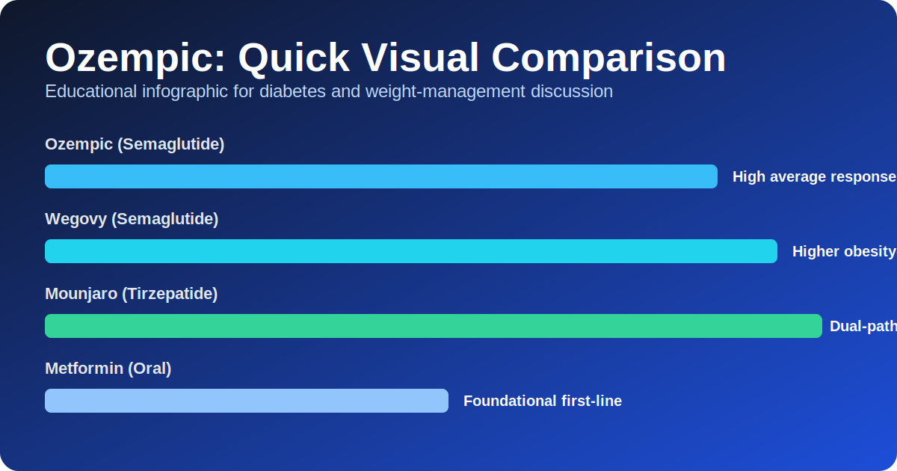

# Ozempic Explained: A Complete, SEO-Friendly Guide to Benefits, Risks, Cost, and Real-World Comparison

**Meta Description:** Learn everything about Ozempic (semaglutide): how it works, who it helps, side effects, weight-loss expectations, pricing, and comparisons with Wegovy, Mounjaro, Saxenda, and metformin in one complete guide.

**Target Keywords:** ozempic, ozempic for weight loss, semaglutide injection, ozempic side effects, ozempic vs wegovy, ozempic vs mounjaro, type 2 diabetes medication, GLP-1 receptor agonist.

**Canonical Topic:** Ozempic as a medication for type 2 diabetes and off-label weight management discussions.

---

## Quick Summary

Ozempic is the brand name for **semaglutide**, a once-weekly injectable medicine approved for adults with type 2 diabetes. It helps lower blood sugar and can also lead to meaningful weight loss in many people. Interest in Ozempic has exploded because it sits at the intersection of modern diabetes care, obesity medicine, and preventive cardiometabolic health.

This long-form guide explains Ozempic from multiple angles: medical science, practical expectations, side effects, safety, cost, and alternatives. You will also find a detailed comparison table and decision framework to discuss with your clinician.

> **Medical note:** This article is educational and not a substitute for personalized medical advice.

---

## Table of Contents

1. [What Is Ozempic?](#what-is-ozempic)
2. [How Ozempic Works in the Body](#how-ozempic-works-in-the-body)
3. [Who Is Ozempic For?](#who-is-ozempic-for)
4. [Ozempic Dosing and Titration](#ozempic-dosing-and-titration)
5. [Expected Benefits: A1C, Weight, and Beyond](#expected-benefits-a1c-weight-and-beyond)
6. [Ozempic Side Effects: Common to Serious](#ozempic-side-effects-common-to-serious)
7. [Who Should Avoid Ozempic](#who-should-avoid-ozempic)
8. [Ozempic vs Wegovy vs Mounjaro vs Saxenda vs Metformin](#ozempic-vs-wegovy-vs-mounjaro-vs-saxenda-vs-metformin)
9. [Cost, Insurance, and Access](#cost-insurance-and-access)
10. [How to Improve Results on Ozempic](#how-to-improve-results-on-ozempic)
11. [Common Myths About Ozempic](#common-myths-about-ozempic)
12. [Frequently Asked Questions](#frequently-asked-questions)
13. [Final Thoughts](#final-thoughts)

---

## What Is Ozempic?

Ozempic is an injectable prescription medication containing **semaglutide**, a **GLP-1 receptor agonist**. It is primarily approved to improve glycemic control in adults with **type 2 diabetes** as part of a broader treatment plan that includes nutrition, physical activity, and other therapies as needed.

Although many people know Ozempic for weight loss, the original medical purpose is diabetes management. Weight reduction can be a clinically useful secondary effect because excess body fat often worsens insulin resistance, blood pressure, fatty liver disease, and inflammation.

Ozempic is administered **once weekly** using a prefilled pen. The once-weekly dosing schedule is a major reason for adherence compared with medications that require daily administration.

### Why Ozempic Became So Popular

Ozempic’s popularity stems from several factors:

- Strong blood sugar reduction in many patients.
- Clinically meaningful weight loss for a large subset of users.
- Convenient weekly dosing.
- Broad public attention around newer obesity and diabetes medicines.
- Increasing physician comfort with GLP-1 class prescribing.

However, popularity does not make a medication right for everyone. Proper use still requires diagnosis, risk stratification, dose titration, and follow-up.

---

## How Ozempic Works in the Body

To understand Ozempic, it helps to understand **GLP-1** (glucagon-like peptide-1), a natural gut hormone released after eating.

Ozempic mimics GLP-1 effects in several ways:

1. **Increases glucose-dependent insulin secretion.**
   When blood sugar is elevated, the pancreas releases more insulin.
2. **Suppresses glucagon when appropriate.**
   Glucagon raises blood glucose; reducing excess glucagon can improve glycemic control.
3. **Slows gastric emptying.**
   Food leaves the stomach more slowly, which can reduce post-meal blood sugar spikes.
4. **Influences appetite pathways in the brain.**
   Many patients report reduced hunger, earlier satiety, and fewer cravings.

Because insulin stimulation is glucose-dependent, GLP-1 drugs generally have a lower standalone hypoglycemia risk than some older diabetes drugs, though risk can increase if combined with insulin or sulfonylureas.

### The Weight-Loss Mechanism in Simple Terms

Weight loss on Ozempic is not a “fat-melting” process. It usually happens because energy intake decreases over time due to:

- Earlier fullness.
- Lower reward response to hyper-palatable foods in some people.
- Better appetite control and fewer binge cycles.

This can make a calorie deficit more sustainable for many users, especially when paired with structured nutrition and resistance training.

---

## Who Is Ozempic For?

Ozempic is generally considered for adults with type 2 diabetes who need improved glycemic control, especially when weight management and cardiometabolic risk are part of the clinical picture.

In real-world practice, clinicians may evaluate:

- Baseline A1C and blood glucose trends.
- Body weight and waist circumference.
- Existing cardiovascular risk factors.
- Kidney function and liver profile.
- Current medications and interaction potential.
- Tolerance for injectable therapies.
- Insurance coverage and medication affordability.

### Off-Label Use and Clinical Ethics

Some patients use Ozempic primarily for obesity management without type 2 diabetes. This is often discussed as off-label prescribing. In many countries, **Wegovy** (also semaglutide, different dosing strategy and obesity indication) is more directly aligned with weight-loss labeling.

Ethically, responsible clinicians should prioritize:

- Patient safety and informed consent.
- Evidence-based obesity treatment.
- Supply stewardship to reduce shortages for diabetes patients.
- Long-term plan instead of short-term cosmetic goals.

---

## Ozempic Dosing and Titration

Ozempic is usually started low and increased gradually to reduce gastrointestinal side effects.

### Typical Dose Progression (Example Pattern)

- **Start:** 0.25 mg weekly (starter dose, not usually the full therapeutic maintenance dose).
- **Then:** 0.5 mg weekly after initial period.
- **Potential increase:** 1 mg weekly depending on goals and response.
- **Higher option in some regions/contexts:** up to 2 mg weekly.

Your exact schedule may differ based on tolerance, blood sugar goals, side effects, and clinician preference.

### Why Slow Titration Matters

A rapid dose increase can worsen nausea, bloating, vomiting, and early discontinuation. Slow escalation helps your digestive system adapt and improves long-term adherence.

### Missed Dose Guidance (General)

Patients should follow product instructions and clinician advice for missed doses. Timing windows matter, and “double dosing” is typically avoided.

---

## Expected Benefits: A1C, Weight, and Beyond

### 1) Blood Sugar Improvement

Many users experience meaningful A1C reduction, particularly when medication adherence, meal planning, sleep, and activity are optimized.

### 2) Weight Reduction

Weight loss varies significantly by person. Factors include genetics, baseline insulin resistance, dietary pattern, sleep quality, stress, thyroid status, co-medications, and dose achieved.

Some people lose substantial weight; others lose modestly or plateau early. A plateau does not always mean failure. It may indicate adaptation requiring strategy refinement.

### 3) Cardiometabolic Benefits

In appropriate patients, GLP-1 therapies can support broader cardiometabolic outcomes by improving glycemia, body weight, and potentially risk markers such as blood pressure or inflammation trajectories.

### 4) Behavioral Advantages

One under-discussed benefit is behavioral: reduced food noise can create mental space for healthier routines. This is not universal, but for many people it is life-changing.

---

## Ozempic Side Effects: Common to Serious

Like all medications, Ozempic has potential adverse effects.

### Common Side Effects

- Nausea
- Vomiting
- Diarrhea
- Constipation
- Bloating or abdominal discomfort
- Reduced appetite (often desired but can become excessive)

These are often dose-related and tend to improve over time, especially with gradual titration and dietary adjustment.

### Less Common but Important Risks

- Dehydration from persistent vomiting/diarrhea
- Gallbladder-related symptoms in some patients
- Pancreatitis warning signs (severe persistent abdominal pain)
- Potential worsening of diabetic retinopathy in select high-risk contexts with rapid glucose changes

### Emergency Symptoms Requiring Immediate Care

Seek urgent medical care for severe persistent abdominal pain, signs of allergic reaction, inability to keep fluids down, or symptoms of severe dehydration.

### Practical Tips to Reduce GI Side Effects

- Eat smaller meals.
- Prioritize protein and fiber, but increase fiber gradually.
- Avoid very high-fat meals near injection timing if nausea-prone.
- Stay hydrated and consider electrolyte support as advised.
- Stop eating before feeling overly full.

---

## Who Should Avoid Ozempic

Ozempic may not be suitable for everyone. Contraindications and cautions vary by label and region, but commonly discussed situations include:

- Personal or family history of medullary thyroid carcinoma (MTC) in specific labeling contexts.
- Multiple endocrine neoplasia syndrome type 2 (MEN2).
- Known hypersensitivity to semaglutide or product components.
- Pregnancy planning or pregnancy (management should be individualized with a clinician).

Patients with complex gastrointestinal disease, prior pancreatitis history, advanced frailty, eating disorder history, or multiple interacting medications need careful specialist-guided evaluation.

---

## Ozempic vs Wegovy vs Mounjaro vs Saxenda vs Metformin

Choosing therapy is not about hype; it is about matching the right tool to the right patient.

### High-Level Comparison Table

| Medication | Active Ingredient | Main Indication | Dosing Frequency | Typical Strengths | Weight-Loss Potential (General) | Key Notes |
|---|---|---|---|---|---|---|
| **Ozempic** | Semaglutide | Type 2 diabetes (and common off-label weight discussions) | Weekly injection | 0.25, 0.5, 1, up to 2 mg contexts | Moderate to high in responders | Strong glycemic control + appetite reduction |
| **Wegovy** | Semaglutide | Chronic weight management (label varies by region) | Weekly injection | Titrated to higher obesity-oriented dose | Often high in responders | Same molecule family; obesity-focused positioning |
| **Mounjaro** | Tirzepatide | Type 2 diabetes (weight indication may vary by market under related branding) | Weekly injection | Multi-step titration | Often very high in many trials | Dual GIP/GLP-1 activity can be powerful |
| **Saxenda** | Liraglutide | Weight management | Daily injection | Daily escalation | Moderate | Daily dosing may reduce adherence for some |
| **Metformin** | Metformin | Type 2 diabetes first-line in many guidelines | Oral daily | Varies | Low to modest | Affordable, widely used, GI effects possible |

### Deeper Comparison: Ozempic vs Wegovy

Ozempic and Wegovy are both semaglutide-based but are marketed and dosed for different primary indications in many regions. For a patient with clear obesity treatment goals without diabetes, Wegovy pathways may align better with official labeling where available.

### Deeper Comparison: Ozempic vs Mounjaro

Mounjaro (tirzepatide) acts on both GIP and GLP-1 receptors. Some data suggest greater average weight loss in certain populations, but individual response can vary dramatically. Cost, tolerability, coverage, and clinician experience all matter.

### Deeper Comparison: Ozempic vs Saxenda

Saxenda is liraglutide and requires daily injection. Some patients still do well on it, especially when weekly injectables are unavailable, poorly tolerated, or not covered.

### Deeper Comparison: Ozempic vs Metformin

Metformin remains foundational for many type 2 diabetes patients due to long experience, low cost, and oral dosing. Ozempic is often considered when metformin alone is insufficient, not tolerated, or when additional weight/cardiometabolic targets are prioritized.

---

## Cost, Insurance, and Access

Medication decisions are often constrained by economics.

### Why Cost Varies

- Country and regulatory market.
- Insurance formulary tier.
- Prior authorization requirements.
- Pharmacy contracts and supply fluctuations.
- Manufacturer assistance eligibility.

### Common Insurance Barriers

- Requirement to try cheaper drugs first.
- A1C threshold requirements for diabetes indication.
- BMI/comorbidity criteria for weight indication.
- Documentation burden and periodic renewal.

### Access Strategy Checklist

1. Confirm diagnosis coding with your provider.
2. Ask for prior authorization support and complete records.
3. Verify preferred pharmacies in your plan network.
4. Compare monthly out-of-pocket projections before starting.
5. Build a continuity plan in case of stock interruptions.

---

## How to Improve Results on Ozempic

Ozempic works best as part of a full system, not as a standalone shot.

### Nutrition Framework

- Prioritize protein at each meal to protect lean mass.
- Build plates around vegetables, legumes, and whole-food fiber.
- Use structured meal timing if random snacking is a trigger.
- Minimize liquid calories and ultra-processed “slider foods.”
- Keep hydration consistent, especially during dose changes.

### Training Framework

- **Resistance training 2–4 times weekly** to preserve muscle.
- Daily walking baseline (for example, 7,000–10,000 steps when feasible).
- Gradual aerobic progression for cardiometabolic conditioning.

### Sleep and Stress

Poor sleep increases hunger hormones and can blunt weight progress. Chronic stress may increase emotional eating and glycemic variability. Treating sleep and stress is not optional if long-term success is the goal.

### Monitoring That Matters

Track more than scale weight:

- Waist circumference
- Blood pressure
- A1C and fasting glucose trends
- Energy and satiety pattern
- Strength performance
- Digestive tolerance

---

## Common Myths About Ozempic

### Myth 1: “Ozempic is only for celebrities.”

False. Ozempic is a legitimate medical therapy for type 2 diabetes and may be considered in broader metabolic care contexts under professional supervision.

### Myth 2: “If you take Ozempic, you never need lifestyle changes.”

False. Lifestyle quality strongly influences outcomes and side-effect burden.

### Myth 3: “Everyone loses the same amount of weight.”

False. Response is highly individualized.

### Myth 4: “Stopping Ozempic has no consequences.”

Not always true. Some patients experience appetite rebound and weight regain if no long-term strategy exists.

### Myth 5: “Ozempic is dangerous for everyone.”

Also false. It has risks and contraindications, but for suitable patients under medical supervision, benefit-risk can be favorable.

---

## Frequently Asked Questions

### 1) How fast does Ozempic work?

Some people notice appetite changes within weeks, but metabolic and weight trajectories usually require months of consistent treatment, titration, and lifestyle integration.

### 2) Is Ozempic insulin?

No. Ozempic is a GLP-1 receptor agonist, not insulin.

### 3) Can Ozempic be used without diabetes?

This depends on regional approvals, product labeling, and clinical judgment. In many places, semaglutide obesity-specific pathways are handled through products designated for weight management.

### 4) What foods should I avoid on Ozempic?

There is no universal forbidden-food list, but many users tolerate treatment better when reducing very large, high-fat meals and highly processed snack patterns.

### 5) Can I exercise while on Ozempic?

Yes, and you should in most cases. Resistance training plus walking is a strong baseline unless your clinician advises otherwise.

### 6) What happens if I stop Ozempic?

Without a maintenance plan, appetite and weight can rebound. Long-term care strategy is crucial.

### 7) Is Ozempic safe long-term?

Long-term safety evaluation continues to evolve with ongoing data, post-marketing surveillance, and patient selection quality.

### 8) Can Ozempic cause muscle loss?

Rapid weight loss from any method can reduce lean mass unless protein intake and resistance training are prioritized.

### 9) Can Ozempic affect mood?

Some patients report mood changes, though experiences vary. Report significant psychological symptoms to your clinician promptly.

### 10) Is compounded semaglutide the same as branded Ozempic?

Quality, sourcing, and regulatory oversight can differ significantly. Use caution and discuss options with a licensed clinician and pharmacist.

---

## Long-Form Expert Discussion: Practical Decision Framework

If you are trying to decide whether Ozempic is appropriate, think in terms of **clinical fit**, **financial fit**, and **behavioral fit**.

### Clinical Fit

A medication is clinically fit when it addresses your primary disease burden, has acceptable contraindication profile, and can be monitored appropriately. For Ozempic, that means clarity around diabetes status, prior treatment history, renal function, gastrointestinal tolerance, and thyroid-related caution contexts.

### Financial Fit

Even highly effective treatment fails if it is unaffordable after month two. Ask about recurring cost, not introductory cost. Confirm pre-authorization validity duration, refill constraints, and alternative pathways if supply disruptions occur.

### Behavioral Fit

Behavioral fit means your daily routine supports the medication. Weekly injections are easier for many people, but travel schedules, shift work, meal structure, and social eating environments still matter. The best therapy is the one you can continue safely for the long term.

### Why Shared Decision-Making Matters

Good clinicians do not merely prescribe; they co-design a strategy. Shared decision-making includes:

- Clarifying realistic outcomes (not miracle narratives).
- Preparing for side effects before they happen.
- Defining success markers beyond a single number on the scale.
- Building a discontinuation/transition plan from day one.

---

## Advanced Comparison: Efficacy, Tolerability, and Sustainability

### Efficacy

Average trial results provide direction, not destiny. Two patients with identical BMI can have very different responses due to sleep debt, chronic stress, polypharmacy, PCOS status, menopause transition, gut tolerance, and eating behavior phenotype.

### Tolerability

A therapy with slightly lower efficacy but excellent tolerability can outperform a “stronger” option that a patient cannot continue. This is especially relevant for patients with sensitive digestion, reflux vulnerability, or previous medication trauma.

### Sustainability

Sustainability includes medication continuity, protein adequacy, strength training consistency, and long-term identity change. If patients perceive treatment as temporary punishment rather than chronic disease management, relapse risk rises.

---

## Building a 12-Month Ozempic Success Plan

### Month 0–1: Setup

- Baseline labs and measurements.
- Education on injection technique and side effects.
- Begin low dose and hydration strategy.
- Establish protein-first meal pattern.

### Month 2–3: Adaptation

- Evaluate dose tolerance.
- Add structured resistance training.
- Improve sleep regularity and late-night eating control.
- Monitor bowel routine and fluid-electrolyte balance.

### Month 4–6: Optimization

- Reassess A1C, fasting glucose, weight, waist, and blood pressure.
- Address plateaus with meal composition changes and activity progression.
- Review adherence barriers: travel, social pressure, cost.

### Month 7–9: Consolidation

- Reinforce habits that survived busy weeks.
- Maintain muscle with progressive overload.
- Build flexible eating skills for holidays and events.

### Month 10–12: Long-Term Strategy

- Decide maintenance dose or transition pathway with clinician.
- Plan for potential dose reduction without behavior collapse.
- Set prevention goals: cardiometabolic and quality-of-life markers.

---

## SEO-Focused Key Takeaways

If you searched for “Ozempic for weight loss,” “Ozempic side effects,” “Ozempic vs Wegovy,” or “Ozempic vs Mounjaro,” here are the main points:

- Ozempic (semaglutide) is primarily a type 2 diabetes medication with notable weight effects in many users.
- Side effects are often gastrointestinal and improve with gradual titration and smart meal strategy.
- Medication choice should be individualized by diagnosis, tolerability, cost, and long-term adherence potential.
- Weekly injection convenience can support consistency, but outcomes still depend on nutrition, movement, sleep, and clinical follow-up.
- Sustainable success is not only about initial weight loss but also maintenance, muscle preservation, and metabolic health.

---

## Final Thoughts

Ozempic is neither a miracle cure nor a villain. It is a potent medical tool that can significantly improve health trajectories when used in the right patient, at the right dose, with the right support system.

The future of metabolic care is increasingly personalized. Instead of debating whether Ozempic is “good” or “bad” in absolute terms, a better question is: **Is Ozempic appropriate for this individual right now, and can we execute the plan safely over time?**

If you discuss Ozempic with your clinician, come prepared with goals, concerns, budget constraints, and your readiness for behavior change. The best outcomes come from aligned expectations and consistent follow-through.

---

## Extended FAQ for Long-Form Readers

### Should I choose Ozempic or wait for newer drugs?

Waiting for “the next better drug” can delay needed treatment. If you already have uncontrolled cardiometabolic risk, current evidence-based options may be more valuable than waiting for a hypothetical future therapy. Discuss timing pragmatically with your clinician.

### Can Ozempic help fatty liver?

Some patients with metabolic dysfunction and weight loss may see liver enzyme improvements, but management should remain comprehensive and physician-led.

### Do I need a specific diet style?

No single diet is mandatory. The most successful plan is one you can sustain while meeting protein, fiber, and energy targets with minimal digestive distress.

### How do I avoid constipation on Ozempic?

Hydration, gradual fiber increase, regular movement, and consistent meal rhythm often help. Persistent symptoms require medical review.

### Is rapid weight loss always better?

Not necessarily. Slower, steadier loss with muscle retention and metabolic stability is often superior to aggressive loss with fatigue and rebound risk.

### Can older adults use Ozempic?

Potentially yes, but dosing, frailty, sarcopenia risk, and polypharmacy require close supervision.

### Can Ozempic be combined with other diabetes medications?

Yes in many cases, but combinations must be individualized to avoid side effects and hypoglycemia risk.

### What if nausea never improves?

Persistent severe nausea may require dose adjustment, slower titration, temporary pause, or switching therapies.

### Is there a “best injection day”?

Choose a consistent weekly day that aligns with your routine and allows side-effect management without disrupting major obligations.

### Do supplements improve Ozempic results?

Most supplement claims are overstated. Prioritize evidence-based basics: protein adequacy, movement, sleep quality, stress management, and medication adherence.

---

**Author’s note:** This guide is designed as a comprehensive educational resource for readers researching Ozempic, semaglutide, and evidence-based weight and diabetes care pathways.

---

## Real-World Clinical Scenarios (Educational Examples)

The following examples are fictionalized educational scenarios, not direct medical advice. They illustrate why Ozempic decisions are individualized.

### Scenario A: Newly Diagnosed Type 2 Diabetes with Obesity

A 42-year-old patient presents with elevated A1C, central obesity, poor sleep, and sedentary work habits. They feel overwhelmed, have tried multiple diets, and struggle with late-night hunger.

A clinician may consider Ozempic because it can address both glycemic control and appetite burden. But medication alone is not enough. The care plan may include:

- One weekly injection schedule synced to a regular weekday.
- Protein-forward breakfasts to reduce daytime cravings.
- Two resistance sessions weekly to preserve muscle.
- Sleep target of 7–8 hours with fixed wake time.
- Follow-up at 4–8 weeks for dose tolerance and symptom review.

Expected challenges include nausea during escalation and unrealistic expectations from social media. The clinician should pre-frame that visible body changes can lag behind metabolic improvements.

### Scenario B: Long-Standing Diabetes with Polypharmacy

A 61-year-old patient with long-standing type 2 diabetes is taking multiple drugs and has occasional hypoglycemia episodes. They ask whether Ozempic can simplify treatment.

In this case, therapy adjustment might reduce reliance on higher-risk combinations, but decisions depend on kidney function, current insulin strategy, and glucose variability. If Ozempic is started, other medications may need recalibration to prevent low blood sugar.

This scenario highlights a key principle: adding Ozempic is often a **systems change**, not just “one more medication.”

### Scenario C: Weight Plateau After Initial Success

A 35-year-old patient loses meaningful weight in the first 4 months, then plateaus for 10 weeks. They fear the medication “stopped working.”

Plateaus are common. Before changing drugs, clinicians may investigate:

- Declining protein intake.
- Reduced non-exercise movement due to fatigue.
- Underreported liquid calories.
- Menstrual-cycle shifts or stress-related water retention.
- Inconsistent injection timing.

Often, structured adjustments restore progress without abandoning treatment.

### Scenario D: Gastrointestinal Intolerance

A patient reports persistent nausea and early satiety severe enough to compromise hydration and daily function. Here, safety takes priority.

Possible steps include:

- Slower titration.
- Temporary dose reduction.
- Small, low-fat meals and fluid scheduling.
- Alternative medication discussion if intolerance persists.

Successful obesity/diabetes care is never about “pushing through at any cost.”

---

## Nutrition on Ozempic: Advanced Practical Guide

Many users ask, “What should I eat on Ozempic?” The better question is, “How do I design meals that support glycemic control, muscle retention, and tolerability?”

### Principle 1: Protein Anchoring

Aim to include protein in each meal. This supports satiety, muscle retention during weight loss, and overall metabolic resilience. Practical options include fish, poultry, eggs, tofu, tempeh, Greek yogurt, legumes, and protein-fortified meals when needed.

### Principle 2: Digestive-Friendly Meal Size

Because Ozempic may slow gastric emptying, very large meals can worsen discomfort. Many people do better with moderate portions and careful chewing.

### Principle 3: Fiber With Gradual Progression

Fiber supports glucose control and bowel regularity, but abrupt large increases can worsen bloating. Increase gradually while maintaining fluid intake.

### Principle 4: Carbohydrate Quality Over Carb Fear

You do not need zero carbs. Emphasize high-quality carbohydrate sources such as vegetables, fruit, legumes, and minimally processed grains as tolerated. Pair carbs with protein and fiber to improve glycemic response.

### Principle 5: Symptom-Responsive Eating

On days with stronger nausea, simpler and lighter meals may help. On better days, return to balanced plates and protein targets.

### Example One-Day Pattern (General Educational Template)

- **Breakfast:** Greek yogurt, berries, chia seeds, and a boiled egg.
- **Lunch:** Grilled chicken salad with olive oil dressing and beans.
- **Snack:** Apple slices with peanut butter.
- **Dinner:** Salmon, roasted vegetables, and quinoa.
- **Hydration:** Water intake distributed across the day.

This is only a framework; personal tolerances vary.

---

## Exercise While Using Ozempic: Protecting Muscle and Metabolism

A common mistake is focusing only on the scale and neglecting lean mass. Preserving muscle is critical for metabolic health, insulin sensitivity, physical function, and long-term weight maintenance.

### The Minimum Effective Training Structure

1. **Resistance training:** 2–4 sessions weekly.
2. **Daily movement:** consistent walking baseline.
3. **Cardio support:** moderate-intensity sessions based on fitness level.

### Why Resistance Training Is Non-Negotiable

During weight loss, total mass decreases from both fat and lean tissue. Without strength stimulus and adequate protein, lean mass losses can be larger than desired.

### Progress Markers Beyond Body Weight

- Increased lifting capacity.
- Better recovery between sets.
- Improved posture and function.
- More stable energy during the day.

Medication may help appetite control, but training preserves the metabolic engine that sustains results.

---

## Behavioral Psychology: The Hidden Driver of Ozempic Outcomes

Medication can reduce appetite, but behavior patterns still determine outcomes.

### The “Food Noise” Concept

Many users describe lower intrusive thoughts about food. This can create an opportunity to relearn cues of true hunger vs emotional eating.

### Habit Stacking for Adherence

Pair the weekly injection with an existing routine, such as after Sunday meal prep or a recurring calendar event. Use reminders, not willpower alone.

### Emotional Eating Interventions

If stress eating remains high, include:

- Structured pause before snacking.
- Pre-planned high-protein alternatives.
- Stress regulation methods (breathing, walking, journaling).
- Professional support when needed.

### Identity Shift

Long-term change often requires identity evolution: from “I’m on a temporary diet” to “I’m a person managing chronic metabolic health.”

---

## Ozempic and Special Populations: Nuanced Considerations

### Women in Perimenopause and Menopause

Hormonal transitions can alter fat distribution, insulin sensitivity, and sleep quality. Medication may help, but sleep support, resistance training, and protein intake become especially important.

### Patients with PCOS Features

Some individuals with insulin resistance and PCOS-related metabolic burden may experience benefit through improved appetite regulation and weight trajectory, though comprehensive endocrine care remains essential.

### Older Adults

Potential benefits must be balanced with risks like sarcopenia, dehydration, and polypharmacy interactions. Monitoring intensity should increase with complexity.

### People with Irregular Work Schedules

Shift workers face circadian disruption, sleep debt, and meal timing challenges. These factors can blunt response unless explicitly addressed in the care plan.

---

## Managing Plateaus and Partial Response

Not every patient achieves dramatic change, and that is normal. A structured troubleshooting approach can improve outcomes.

### Step 1: Verify Adherence and Technique

- Confirm weekly dose timing consistency.
- Review injection technique and storage.
- Check refill continuity and missed doses.

### Step 2: Review Intake Quality

- Hidden calories from beverages.
- “Healthy” foods with high energy density.
- Low protein intake causing unstable hunger.

### Step 3: Review Output and Recovery

- Step count drift over time.
- Reduced training intensity.
- Sleep debt and stress overload.

### Step 4: Reassess Medical Variables

- Thyroid profile when indicated.
- Medication interactions affecting appetite/weight.
- Fluid retention confounding scale trends.

### Step 5: Shared Clinical Adjustment

- Dose strategy review.
- Add-on or alternative therapy consideration.
- Focus on health markers beyond weight alone.

---

## Risk Communication: Balanced and Responsible

In public conversations, Ozempic is often either overhyped or overfeared. Both extremes harm patients.

### Overhype Risks

- Unrealistic timelines.
- Underestimating side effects.
- Ignoring contraindications.
- Promoting unsupervised use.

### Overfear Risks

- Delaying effective treatment.
- Framing all pharmacotherapy as failure.
- Stigmatizing patients with chronic disease.

### Better Communication Principles

- Present probabilities, not absolutes.
- Distinguish common mild effects from rare severe events.
- Emphasize supervision and follow-up.
- Respect patient autonomy with informed consent.

---

## A Practical Pre-Consultation Checklist for Patients

Before discussing Ozempic with your clinician, prepare the following:

1. Recent lab values (if available): A1C, fasting glucose, lipids.
2. Weight and waist trend over recent months.
3. Current medication list including supplements.
4. Personal/family history relevant to contraindications.
5. Budget range and insurance details.
6. Primary goal (glycemia, weight, cardiovascular risk, quality of life).
7. Top concerns (side effects, injections, long-term use, access).

Prepared patients usually have more productive appointments and better outcomes.

---

## 90-Day Outcome Dashboard Template

Use a simple dashboard to monitor progress:

| Domain | Baseline | 30 Days | 60 Days | 90 Days | Notes |
|---|---:|---:|---:|---:|---|
| Body weight |  |  |  |  | |
| Waist circumference |  |  |  |  | |
| Fasting glucose |  |  |  |  | |
| Average appetite score (1–10) |  |  |  |  | |
| Training sessions/week |  |  |  |  | |
| Daily steps (average) |  |  |  |  | |
| Sleep hours/night |  |  |  |  | |
| GI symptoms (mild/mod/severe) |  |  |  |  | |

This dashboard encourages objective review instead of emotion-driven judgments.

---

## Final SEO Recap (Keyword-Rich, User-Centered)

If your search intent includes terms like **Ozempic for weight loss**, **Ozempic side effects**, **semaglutide injection**, **Ozempic vs Wegovy**, or **Ozempic vs Mounjaro**, the practical answer is this: Ozempic can be highly effective for the right patient, but success depends on smart titration, side-effect management, affordability, and a durable lifestyle framework.

The best outcomes happen when medical treatment and behavior change move together. For many people, Ozempic opens the door; disciplined execution determines how far they go.

---

## Conclusion for Readers, Clinicians, and Care Teams

Ozempic represents a major shift in how we approach chronic metabolic disease. For decades, many patients were told to “just eat less and move more,” even when biology, hormones, sleep disruption, and medication burden made that advice insufficient. Newer therapies such as semaglutide do not replace personal responsibility, but they can correct biological barriers that previously made success far harder.

For **patients**, the most useful mindset is long-term stewardship: learn your triggers, track meaningful markers, protect muscle, and stay in regular communication with your care team.

For **clinicians**, the opportunity is precision care: select patients carefully, titrate thoughtfully, communicate risk honestly, and measure outcomes beyond scale weight.

For **families and support systems**, remember that sustainable change requires empathy. Shame is not a treatment strategy; structure and support are.

Ultimately, the most important question is not whether Ozempic is trendy. The important question is whether a given patient can use it safely, afford it consistently, tolerate it clinically, and integrate it into a life they can realistically maintain for years.

### One More Practical Reminder

No medication decision should be made from social media clips alone. Bring your full history, lab trends, and treatment priorities into a real consultation. Ask about alternatives, side-effect plans, cost contingencies, and long-term follow-up. If you start Ozempic, treat the first months as a learning period, not a perfection contest. Small consistent actions—better sleep, better meal structure, regular movement, and honest monitoring—compound over time. That compounding effect is where durable health gains are built.
